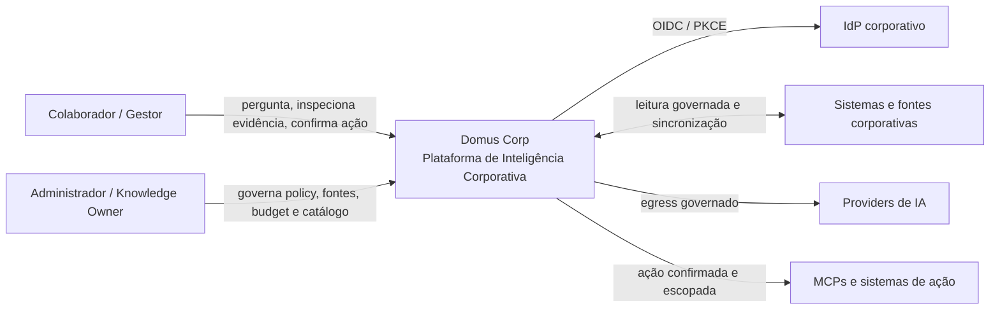
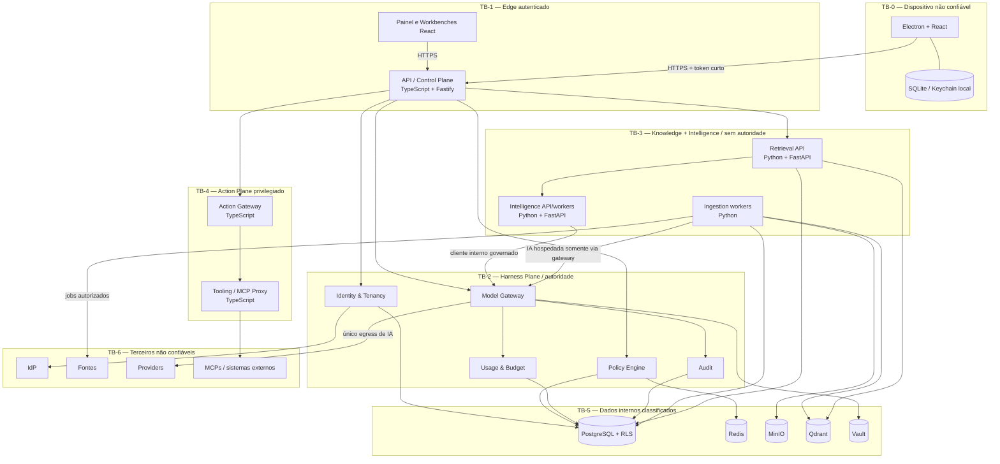
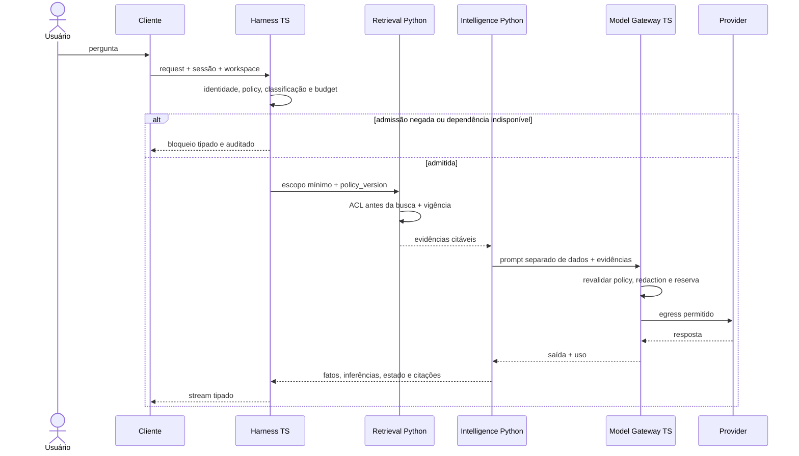
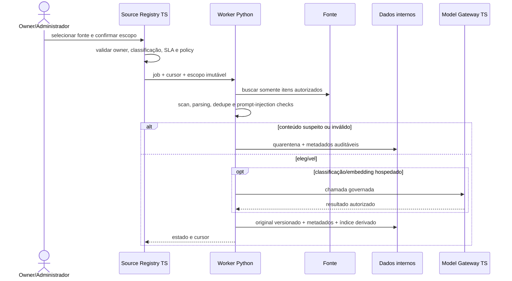
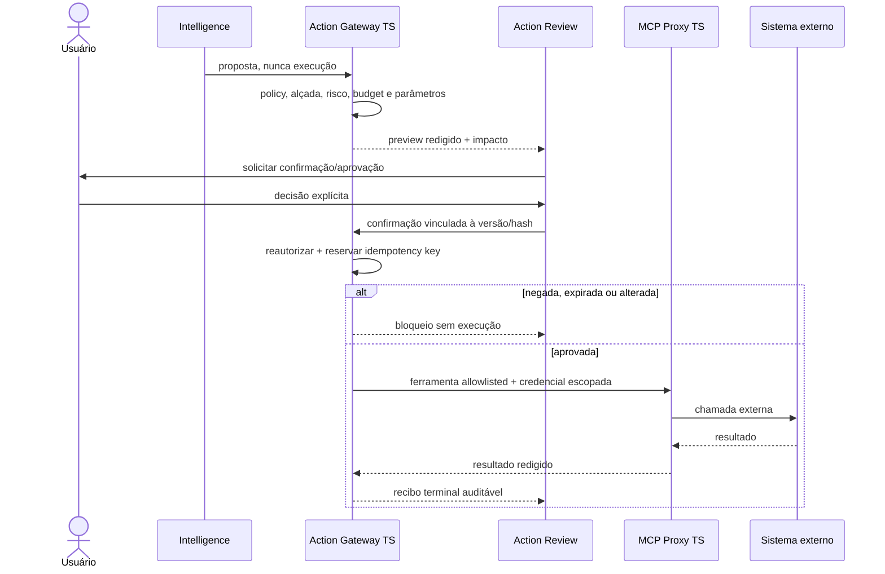

# V1-002 — Arquitetura C4 e fluxos críticos

**Status:** Aprovado  
**Data:** 07/08/2026  
**Aprovador:** Marcos Wasem  
**Escopo:** C4 níveis 1 e 2, fronteiras de confiança e fluxos de pergunta, ingestão e ação

Este documento torna renderizável a arquitetura proposta pelo ADR-001. Os diagramas usam Mermaid e preservam a separação entre os planos Harness, Knowledge, Intelligence e Action. O Quality Loop é uma capacidade transversal, não um quinto ponto de autoridade.

## 1. Invariantes

1. O Model Gateway TypeScript é o único egress para LLMs, embeddings hospedados e APIs de providers.
2. MCPs e escrita externa só são alcançados pelo Tooling/MCP e pelo Action Gateway TypeScript.
3. Serviços Python recebem identidade e `EffectivePolicy` versionadas, podem reduzir o escopo e nunca ampliá-lo.
4. PostgreSQL é a fonte transacional; MinIO e Qdrant armazenam derivados/originais sujeitos à autoridade e ao ciclo de vida registrados no PostgreSQL.
5. Falha de identidade, policy, ACL, classificação, budget, auditoria ou aprovação bloqueia a operação.
6. Memória pessoal local não é conhecimento corporativo até passar por publicação, classificação, owner e aprovação.

## 2. C4 — Contexto

## 3. C4 — Containers e trust boundaries

As setas representam caminhos permitidos, não autorização implícita. Identidades de workload, allowlists de rede e validação de contrato devem tornar os caminhos proibidos tecnicamente indisponíveis.

## 4. Fluxo de pergunta fundamentada

## 5. Fluxo de ingestão

## 6. Fluxo de ação

## 7. Encaminhamentos

- A ingestão acessará fontes por connector isolado dentro de TB-3, limitado a fontes registradas e sem acesso a provider, MCP ou destino de ação. Uma mudança para proxy dedicado TypeScript exigirá análise arquitetural, mas não altera essa restrição.
- Definir, na V1-003, os schemas e protocolos das setas cross-runtime.
- Materializar allowlists, identidades de workload e políticas de rede na V1-006.

## 8. Aprovação

Marcos Wasem aprovou esta arquitetura em 07/08/2026. Alterações nas invariantes, trust boundaries ou caminhos de egress exigem registro pela matriz de mudanças e, quando aplicável, novo ADR.
