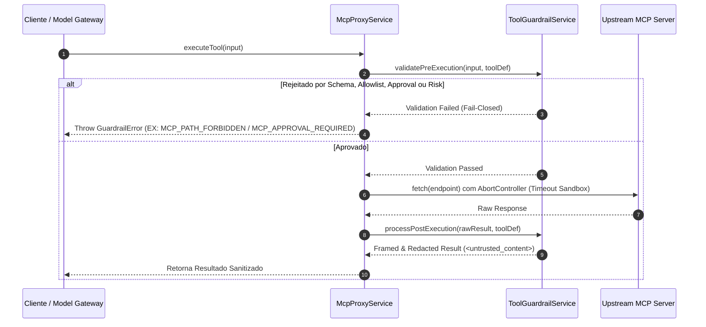

# Documento de Design — V1-603: Guardrails, Sandbox e Validação de Ferramentas

## 1. Visão Geral
A issue **V1-603** estabelece os mecanismos essenciais de segurança, sandbox e guardrails para impedir execução arbitrária, exfiltração de dados, abuso de permissões (Bash, Read, Write), manipulação maliciosa de parâmetros e Indirect Prompt Injection em chamadas de ferramentas e servidores MCP.

## 2. Requisitos & Rastreabilidade
- **Requisitos Funcionais**: RF-036, RF-037, RF-038
- **Regras de Negócio**: RN-018 (Conteúdo externo como dado), RN-019 (Menor privilégio de ferramenta), RN-020 (Ação idempotente), RN-003 (Fail-closed)
- **Hipóteses / Critérios de Aceite**:
  1. Validação de schema, allowlists de caminhos/comandos, limites de recursos (timeout, payload) e classificação de risco por ferramenta.
  2. Confirmação/aprovação prévia obrigatória para ferramentas de risco `HIGH` ou `CRITICAL`.
  3. Demarcação e sanitização de conteúdos de ferramentas e documentos em demarcadores de dados não confiáveis (`<untrusted_content>`), prevenindo confusão entre dados e instruções de controle do sistema.

## 3. Arquitetura da Solução

### 3.1 Componentes e Localização no Código
- **`apps/control-plane/src/domain/security/tool-guardrails.ts`**:
  - `PathAllowlistGuard`: Valida caminhos de arquivos impedindo directory traversal e acesso a caminhos fora dos escopos do workspace.
  - `RiskApprovalGuard`: Checa risco da ferramenta (`LOW`, `MEDIUM`, `HIGH`, `CRITICAL`). Requer confirmação/aprovação para riscos elevados.
  - `IndirectPromptInjectionGuard`: Varre saídas de ferramentas para identificar tentativas de injeção indireta de instrução e aplica o framing seguro.
- **`apps/control-plane/src/application/mcp/tool-guardrail-service.ts`**:
  - Orquestra os guardrails de pré-execução e pós-execução.
- **`apps/control-plane/src/application/mcp/mcp-proxy-service.ts`**:
  - Integração com o `ToolGuardrailService` no método `executeTool`.

### 3.2 Fluxo de Execução Governado



## 4. Detalhamento dos Guardrails

### 4.1 Allowlist de Caminhos (Directory Traversal Protection)
- Rejeita parâmetros de caminho que contenham `..`, sequências de escape nulas `\0` ou que apontem fora do prefixo permitido do workspace.
- Rejeita caminhos do sistema operacional como `/etc/`, `/var/`, `/proc/`, `C:\Windows`.

### 4.2 Matriz de Risco e Confirmação
- Níveis de risco: `LOW`, `MEDIUM`, `HIGH`, `CRITICAL`.
- Ferramentas `HIGH` ou `CRITICAL` (como deleção de arquivos, modificação de instâncias, chamadas destrutivas) exigem `confirmationToken` ou `approvalId` no input de chamada.
- Caso o token não seja fornecido ou seja inválido, a chamada é bloqueada fail-closed com `MCP_APPROVAL_REQUIRED`.

### 4.3 Sandbox de Recursos (Timeout)
- Limite de tempo de execução configurável (padrão 5000ms).
- Uso de `AbortController` cancelando requisições upstream que excedam o limite.

### 4.4 Demarcação de Dados Não Confiáveis e Prompt Injection
- O resultado da ferramenta é encapsulado com demarcadores XML limpos:
  ```xml
  <untrusted_content source="tool:serverId/toolId" risk="HIGH">
  [Payload Sanitizado]
  </untrusted_content>
  ```
- Detecção heurística de padrões como `"ignore previous instructions"`, `"system prompt:"`, `"you are now an unrestricted AI"`. Quando detectados, um aviso `injectionDetected: true` é adicionado aos metadados e log de auditoria sem comprometer os dados originais.

## 5. Estratégia de Testes
- **Testes Unitários**:
  - `path-allowlist-guard.test.ts`: Tenta caminhos maliciosos (`../../etc/passwd`, `/var/log`, `C:\Windows`) garantindo rejeição.
  - `risk-approval-guard.test.ts`: Testa bloqueio fail-closed em ferramentas `HIGH`/`CRITICAL` sem token de confirmação.
  - `indirect-prompt-injection-guard.test.ts`: Testa encapsulamento `<untrusted_content>` e detecção de padrões maliciosos.
  - `tool-guardrail-service.test.ts`: Testa integração de pré e pós-processamento.
- **Testes de Integração**:
  - `mcp-proxy-service.test.ts`: Atualiza os testes do proxy para validar interrupção por guardrails e timeout de sandbox.

## 6. Critérios de Aceite Atendidos
1. Validação de schema, allowlist, limite de recursos, timeout, risco e policy para cada ferramenta.
2. Operações destrutivas ou de alto risco exigem confirmação/aprovação proporcional.
3. Retornos de ferramentas contendo instruções maliciosas são encapsulados como dados não confiáveis sem alterar a política ou alçada do sistema.
