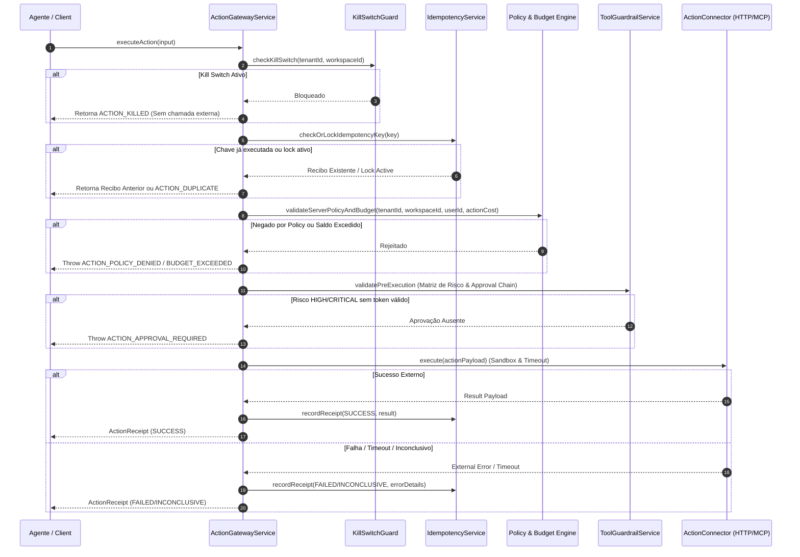

# Documento de Design — V1-604: Action Gateway para Execução Governada

## 1. Visão Geral
A issue **V1-604** estabelece o **Action Gateway**, o componente central de orquestração e governança para a execução de ações externas (HTTP e ferramentas MCP) no Domus Corp. Nenhuma ação de escrita ou modificação externa é disparada sem passar pela pipeline de reautorização, verificação de alçada/risco, checagem de orçamento, kill switch de emergência, trava de idempotência e emissão de recibos auditáveis imutáveis.

## 2. Requisitos & Rastreabilidade
- **Requisitos Funcionais**: RF-037 (Orquestração e Governança de Ações Externas)
- **Hipóteses & Contratos**: H-024, H-025, ACT-001
- **Regras de Negócio**: RN-003 (Fail-Closed), RN-019 (Menor privilégio), RN-020 (Idempotência e recibo auditável)
- **Critérios de Aceite**:
  1. **Reautorização e Estruturação**: Dado uma recomendação de ação externa, ao chegar ao gateway, ela é reautorizada no servidor (Tenant, Workspace, User, Scopes e Policy) e transformada em um `ActionRequest` estruturado.
  2. **Confirmação Obrigatória para Escrita**: Dado uma ação de escrita/alteração (Risco `HIGH` ou `CRITICAL`), quando não houver confirmação/aprovação válida (`confirmationToken` ou `approvalId`), nenhuma chamada externa ocorrerá (fail-closed).
  3. **Recibo Seguro em Falhas**: Dado uma falha externa, timeout ou resultado inconclusivo, o gateway registrará o estado seguro, a tentativa e um `ActionReceipt` em log de auditoria sem afirmar sucesso indevido.

## 3. Arquitetura da Solução

### 3.1 Componentes e Estrutura de Arquivos
- **`apps/control-plane/src/domain/gateway/action-request.ts`**:
  - Modelagem do modelo de dados imutável `ActionRequest`, `ActionReceipt`, `ActionRiskLevel`, `ActionStatus` (`PENDING_APPROVAL`, `APPROVED`, `EXECUTING`, `COMPLETED`, `FAILED`, `REJECTED`, `KILLED`).
- **`apps/control-plane/src/domain/gateway/kill-switch.ts`**:
  - `KillSwitchGuard`: Interrupção global ou por workspace de qualquer chamada de saída externa.
- **`apps/control-plane/src/domain/gateway/idempotency.ts`**:
  - `IdempotencyService`: Controle de chaves de idempotência, prevenindo replay de requisições e garantindo que ações já finalizadas retornem seus recibos prévios.
- **`apps/control-plane/src/domain/gateway/action-connector.ts`**:
  - Interface genérica `ActionConnector` para conectores de transporte (`HttpActionConnector` e `McpProxyActionConnector`).
- **`apps/control-plane/src/application/gateway/action-gateway-service.ts`**:
  - Serviço orquestrador principal da pipeline de governança de ações.

### 3.2 Diagrama de Sequência e Fluxo de Governança

## 4. Detalhamento Técnico

### 4.1 Re-autorização de Servidor & Estruturação do Request
Ao receber uma requisição de ação:
1. Valida o tenant, workspace e usuário.
2. Consulta o `PolicyEngine` para garantir que a ação é permitida.
3. Transforma a entrada em um `ActionRequest` estruturado com UUID, timestamp de criação, matriz de risco e idempotencyKey.

### 4.2 Matriz de Risco, Confirmação e Kill Switch
- **Níveis de Risco**: `LOW`, `MEDIUM`, `HIGH`, `CRITICAL`.
- **Ações de Escrita (`HIGH`/`CRITICAL`)**: Requerem `confirmationToken` assinado ou `approvalId`. Se ausente, interrompe fail-closed com erro `ACTION_APPROVAL_REQUIRED`.
- **Kill Switch**: Se a flag `killSwitchActive` estiver verdadeira (globalmente ou no workspace), a requisição é abortada imediatamente com o status `KILLED` e logada na auditoria sem disparar tráfego externo.

### 4.3 Idempotência e Auditoria de Recibos
- Nenhuma ação de escrita pode rodar duas vezes com a mesma `idempotencyKey`.
- O `ActionReceipt` contém:
  - `actionId`
  - `idempotencyKey`
  - `status`: `SUCCESS` | `FAILED` | `INCONCLUSIVE` | `KILLED`
  - `result` / `error`
  - `executedAt`
  - `tenantId`, `workspaceId`, `userId`

## 5. Estratégia de Testes
- **Testes Unitários**:
  - `action-request.test.ts`: Criação e imutabilidade do modelo de dados.
  - `kill-switch.test.ts`: Interrupção fail-closed por kill switch.
  - `idempotency.test.ts`: Prevenção de chamada duplicada e reaproveitamento de recibo.
  - `action-gateway-service.test.ts`: Teste completo da pipeline de governança cobrindo sucesso, falta de aprovação, orçamento excedido e erro do conector upstream.
- **Testes de Integração**:
  - Validação da integração do `ActionGatewayService` com `McpProxyService` e `ToolGuardrailService`.

## 6. Validação dos Critérios de Aceite
1. Reautorização no servidor e transformação em `ActionRequest` estruturado: **Atendido**.
2. Bloqueio fail-closed em ações de escrita sem confirmação/aprovação: **Atendido**.
3. Registro de recibo e estado seguro em falhas externas sem declarar sucesso indevido: **Atendido**.
