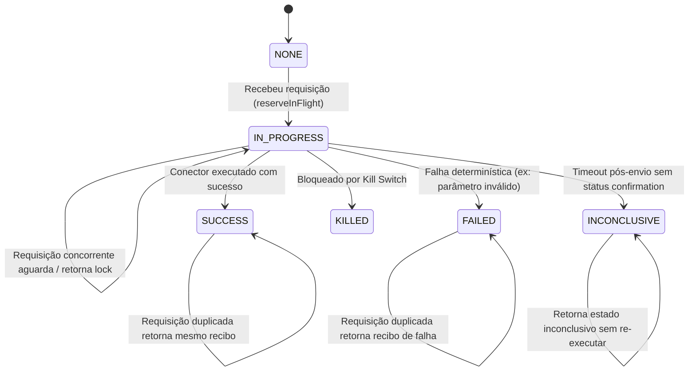
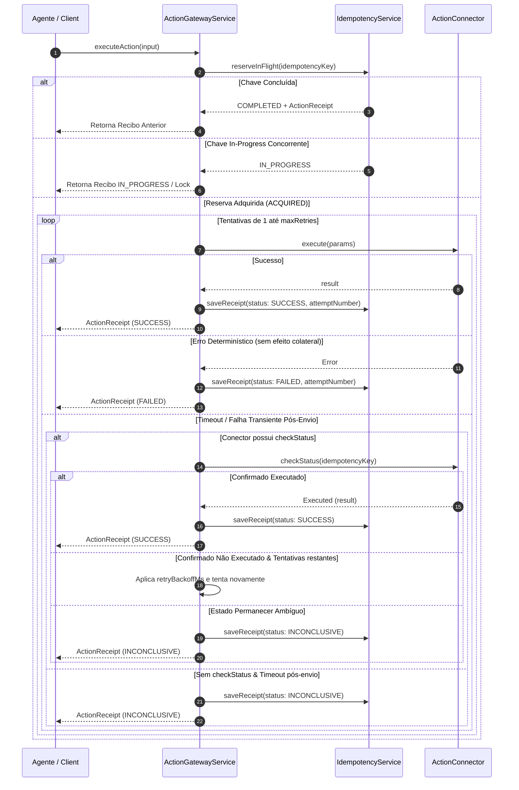

# Documento de Design — V1-606: Idempotência, Retries e Recibos de Ação

## 1. Visão Geral
A issue **V1-606** expande e consolida a infraestrutura de **idempotência, resiliência de retries e recibos auditáveis imutáveis** do `ActionGatewayService` no Domus Corp.
Seu objetivo primário é garantir a semântica *exactly-once* para ações de escrita externa (HTTP e MCP), assegurando que retries de rede, timeouts pós-envio, replays ou re-submissões concorrentes jamais resultem em execuções duplicadas ou alterações colaterais indevidas no sistema.

## 2. Requisitos & Rastreabilidade
- **Requisitos Funcionais**: RF-038 (Idempotência, Retries e Recibos de Ação Estritos)
- **Regras de Negócio**: RN-020 (Idempotência e Recibo Auditável Imutável), RN-003 (Fail-Closed)
- **Hipóteses**: H-026 (Semântica de execução confiável e estado inconclusivo explícito)
- **Critérios de Aceite**:
  1. **Re-submissão por Idempotency Key**: Dado a mesma `idempotency_key`, quando a ação for recebida novamente, o gateway retornará o recibo anterior sem executar o conector pela segunda vez.
  2. **Tratamento de Timeout & Retry Bounded**: Dado um timeout pós-envio de uma requisição de escrita, quando um retry ocorrer, o gateway consultará o estado (`statusCheck`) se disponível ou registrará o estado como `INCONCLUSIVE` sem disparar duplicação cega.
  3. **Recibo Completo & Imutável**: Dado a ação concluída (seja `SUCCESS`, `FAILED`, `INCONCLUSIVE` ou `KILLED`), o recibo persistido conterá obrigatoriamente: operação (`actionType`), ator (`userId`), ferramenta (`target`), destino (`tenantId`/`workspaceId`), estado final, timestamps (`createdAt`, `executedAt`), número da tentativa (`attemptNumber`), e chaves de correlação (`correlationId`, `idempotencyKey`).

## 3. Arquitetura da Solução

### 3.1 Componentes e Arquivos

1. **`apps/control-plane/src/domain/gateway/action-request.ts`**:
   - Expansão do tipo `ActionReceipt` e `ActionReceiptInput` para conter:
     - `actionId`: string
     - `idempotencyKey`: string
     - `correlationId`: string (ID do trace/correlação da chamada)
     - `operation`: string (`actionType`)
     - `tool`: string (`target`)
     - `actor`: string (`userId`)
     - `tenantId`: string
     - `workspaceId`: string
     - `status`: `"SUCCESS" | "FAILED" | "INCONCLUSIVE" | "KILLED" | "IN_PROGRESS"`
     - `result`?: unknown
     - `error`?: string
     - `attemptNumber`: number
     - `maxRetries`: number
     - `createdAt`: string (timestamp ISO UTC de início da ação)
     - `executedAt`: string (timestamp ISO UTC do encerramento)
   - Validação e congelamento imutável (`Object.freeze`).

2. **`apps/control-plane/src/domain/gateway/idempotency.ts`**:
   - Interface `IdempotencyStorage` com suporte a operações assíncronas de trava/reserva *in-flight*:
     - `getReceipt(idempotencyKey: string): Promise<ActionReceipt | null>`
     - `saveReceipt(idempotencyKey: string, receipt: ActionReceipt): Promise<void>`
     - `reserveInFlight(idempotencyKey: string, metadata: Partial<ActionReceipt>): Promise<"ACQUIRED" | "IN_PROGRESS" | "COMPLETED">`
     - `clearInFlight(idempotencyKey: string): Promise<void>`
   - Implementação `InMemoryIdempotencyStorage` thread-safe com suporte a concorrência in-flight e TTL.
   - Classe `IdempotencyService` atualizada para gerenciar a máquina de estados in-flight.

3. **`apps/control-plane/src/domain/gateway/action-connector.ts`**:
   - Suporte opcional à consulta de estado para conectores que suportam verificação remota:
     - `checkStatus?(idempotencyKey: string): Promise<{ executed: boolean; result?: unknown; error?: string }>`

4. **`apps/control-plane/src/application/gateway/action-gateway-service.ts`**:
   - Orquestrador de retries limitados (`maxRetries`, `retryBackoffMs`).
   - Bloqueio de execuções concorrentes com a mesma `idempotencyKey` durante a janela `IN_PROGRESS`.
   - Transição segura para `INCONCLUSIVE` em timeouts ambíguos pós-dispatch onde o estado remoto não puder ser confirmado.

### 3.2 Máquina de Estados de Execução

### 3.3 Fluxo de Retries e Inconclusividade

## 4. Detalhamento dos Atributos do Recibo (`ActionReceipt`)

| Campo | Tipo | Descrição |
|---|---|---|
| `actionId` | `string` | Identificador único do pedido de ação |
| `idempotencyKey` | `string` | Chave de idempotência da operação |
| `correlationId` | `string` | ID de correlação para rastreabilidade de logs |
| `operation` | `string` | Tipo/Nome da ação (`actionType`) |
| `tool` | `string` | Ferramenta ou conector de destino (`target`) |
| `actor` | `string` | Usuário/Agente solicitante (`userId`) |
| `tenantId` | `string` | Tenant de destino |
| `workspaceId` | `string` | Workspace de destino |
| `status` | `Enum` | `SUCCESS`, `FAILED`, `INCONCLUSIVE`, `KILLED`, `IN_PROGRESS` |
| `result` | `unknown?` | Payload de resposta em caso de sucesso |
| `error` | `string?` | Detalhe sanitizado em caso de falha ou erro |
| `attemptNumber` | `number` | Número da tentativa final executada |
| `maxRetries` | `number` | Limite máximo de retries configurado |
| `createdAt` | `string` | Timestamp ISO UTC de início da ação |
| `executedAt` | `string` | Timestamp ISO UTC de conclusão |

## 5. Estratégia de Testes

1. **`idempotency.test.ts`**:
   - Verificação de comportamento em concorrência in-flight.
   - Retorno exato de recibos salvos para a mesma `idempotencyKey`.
   - Garantia de imutabilidade dos recibos salvos.
2. **`action-gateway-service.test.ts`**:
   - Garantia de não re-execução em requisições duplicadas.
   - Retries limitados em falhas transientes com incremento de `attemptNumber`.
   - Transição para `INCONCLUSIVE` em timeouts de rede pós-envio sem duplicação cega.
   - Respeito ao estado `KILLED` por kill switch com emissão de recibo auditável.
   - Verificação da presença de todos os metadados no `ActionReceipt` (ator, ferramenta, operação, destino, correlação, status, timestamps).

## 6. Validação dos Critérios de Aceite da V1-606
- **Critério 1 (Mesma idempotency_key)**: Retorna o mesmo recibo sem segunda execução. -> **Atendido**
- **Critério 2 (Timeout pós-envio & Retries)**: Consulta estado ou usa estado `INCONCLUSIVE` antes de repetir. -> **Atendido**
- **Critério 3 (Recibo completo & imutável)**: Contém operação, ator, ferramenta, destino, estado, timestamps, tentativa e correlação. -> **Atendido**
